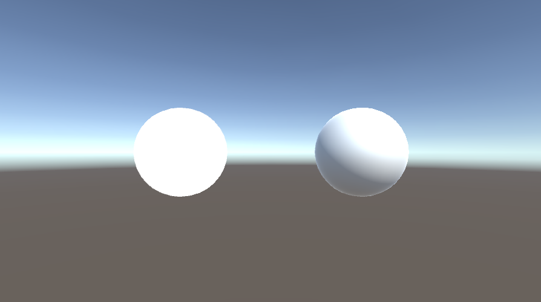
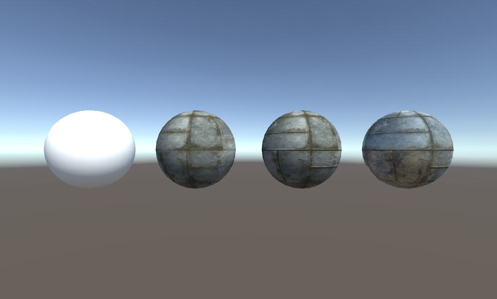

# テキストによるシェーダの記述
シェーダグラフではなく、テキストベースのシェーダを記述してみましょう

## 結果画像

## 自分なりにかっこいいシーン

# 自分なりに変更した点
- フレネル効果とTimeを利用した
-
-

# 進め方

- 本リポジトリをフォークしてください
- フォークしたリポジトリをcloneします
- Unityのプロジェクトを更新して実装してください。
  - 結果画像1（一番上の画像）と同じシーンを「1 two spheres Scene」に実現してください
  - [Unity ユーザーマニュアル:サーフェイスシェーダーの例](https://docs.unity3d.com/ja/current/Manual/SL-SurfaceShaderExamples.html)を参考に、結果画像2（二番目の画像）と同じようなシーンを「2 PBR Scene」に実現してください（テクスチャは自分で用意してください）
  - 自分なりにかっこいいシーンを「My Best Scene」に作成してください
- 「My Best Scene」の結果をUnity Recorder等で保存し、result.pngという名前にして本ディレクトリの物と差し替えてください（動画の方が好ましいです）
- このテキストファイルに変更点を記載してください
- プルリクエストを出して提出してください
